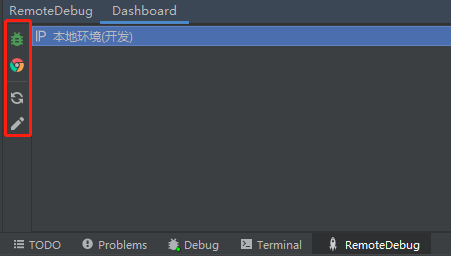

# remote-debug


## 插件描述

<!-- Plugin description -->

远程 debug 工具

- 通过在项目根目录配置 `rdebug.yml` 获取机器信息快速进行 debug 配置


- 快速替换被 debug 机器的 class 文件


<!-- Plugin description end -->

## 下载地址

[remote-debug-1.0.0.jar](https://github.com/tanghuibo/remote-debug/releases/download/1.0.0/remote-debug-1.0.0.jar)

## 插件扩展

### 自定义配置文件解析

如果你的机器信息需要动态获取 (例如通过网络获取), 你可以自己实现 `ConfigReadStrategy`, 并将其注册到 `ConfigReader`

```java
private static List<ConfigReadStrategy> configReadStrategyList = Arrays.asList(
        new IpConfigReadStrategyImpl()
)
```
### 自定义 action



如果想在面变中添加 `action`, 你可以自己实现 `AbsTaskAction`, 并将其注册到 `MainToolbarViewBuilder`

```java
private List<AbsTaskAction> buildBottomAction() {
    return Arrays.asList(new RefreshAction(), new EditAction());
}

private List<AbsTaskAction> buildTopAction() {
    return Arrays.asList(new DebugAction(), new BrowserAction());
}
```
## 插件搭建步骤

从 [intellij-platform-plugin-template](https://github.com/JetBrains/intellij-platform-plugin-template) 通过 [Use this template]() 按钮 fork 代码到自己的仓库

## 核心构建配置

### gradle.properties

gradle 配置文件，可以在里面配置开发 java 插件的依赖，如

```properties
# Plugin Dependencies -> https://plugins.jetbrains.com/docs/intellij/plugin-dependencies.html
# Example: platformPlugins = com.intellij.java, com.jetbrains.php:203.4449.22
platformPlugins = java
```

### build.gradle.kts

gradle 核心构建文件，可以在里面添加 pom 依赖，如

```kotlin
dependencies {
    implementation("com.fasterxml.jackson.dataformat:jackson-dataformat-yaml:2.13.0")
    implementation("com.fasterxml.jackson.core:jackson-databind:2.13.0")
}
```

设置 utf-8 编码

```kotlin
tasks {
    // Set the JVM compatibility versions
    properties("javaVersion").let {
        withType<JavaCompile> {
            sourceCompatibility = it
            targetCompatibility = it
            options.encoding = "UTF-8"
        }
    }
}
```
